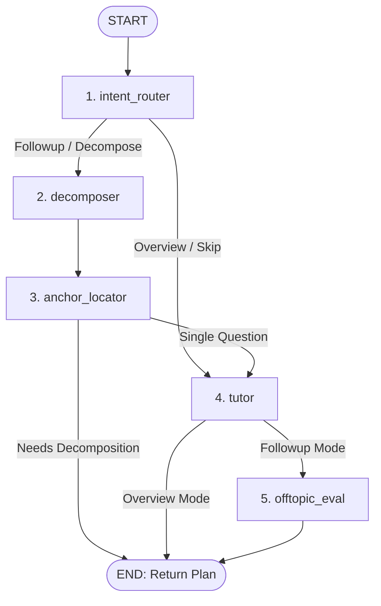

# LatentLearn 🧠🌲

> **A Spatial, Non-Linear Learning Platform Tailored for Divergent Minds. Built with Next.js, FastAPI, and Stateful LangGraph Multi-Agent Orchestration.**

### 🌐 Live Deployment
- **Frontend Web App (Vercel)**: 🌍 [https://latent-learn.vercel.app](https://latent-learn.vercel.app)
- **Backend Agent API (Hugging Face)**: 🤖 [https://howcloudy-latentlearn-agent.hf.space](https://howcloudy-latentlearn-agent.hf.space) | 🟢 [API Health Status](https://howcloudy-latentlearn-agent.hf.space/health)

---

## 🌟 The UX Paradigm: Breaking the Linear Trap

Traditional conversational interfaces (like standard ChatGPT or Claude) enforce a **linear waterfall model** of interaction: you ask, the AI answers, and you follow up in a single, vertical thread. 

For **divergent thinkers, associative learners, or individuals with ADHD**, this linear model acts as a cognitive bottleneck. When exploring complex topics, associative minds naturally branch off—diving deep into tangential details, which then trigger sub-tangents. 
In a linear thread, this "rabbit hole" exploration creates two severe problems:
1.  **Context Pollution:** The model's conversational history is diluted with secondary details, degrading its understanding of the primary subject.
2.  **Losing the Trunk:** Returning to the original high-level topic requires massive scrolling and a high cognitive load, frequently causing the user to lose their train of thought and abandon the session.

**LatentLearn** resolves this by representing the learning journey as a hierarchical **Focus Tree** on a spatial canvas. Users can freely explore tangents, spin off sub-branches on any detail, and gracefully return to the main learning path with zero clutter once their curiosity is satisfied.

---

## ✨ Key Capabilities

-  **Spatial Text Highlighting (Inline Branching):** Simply highlight any phrase in the AI's response. A custom contextual menu allows you to click `Ask`, `Explain`, or `Expand` to instantly spawn a new conversational card anchored to that precise location.
-  **Hierarchical Focus Tree Visualizer:** A side-drawer panel renders an interactive visual map of your study nodes. Highlighting a card instantly focuses its node in the tree; clicking a tree node smooth-scrolls the canvas to that exact branch.
-  **Cognitive Guardrails (Off-Topic Detector):** To protect users from endless distractions, a background evaluator detects when a sub-branch drifts too far from the core subject. It generates the response but displays a prominent refocus prompt to return to the core learning path with one click.
-  **Branch Resolution & Decluttering:** When a concept is fully understood, click `Got it` (已理解). The sub-branch fades and collapses, automatically returning focus back to the parent node.

---

## 📺 Product Demonstration

> [!NOTE]
> **Video and Animated GIF demonstrations are currently being recorded.**
> Once finalized, an interactive walk-through showing the fluid glassmorphism transitions, reactive side-drawer tree nodes, inline highlighting triggers, and off-topic notification alerts will be displayed right here!

---

## 🛠️ Technical Stack & Roadmap (技术路线)

LatentLearn is architected as an decoupled, event-driven system combining high-performance Python agents with a highly reactive, responsive React interface.

```
       +-------------------------------------------------------+
       |                  NEXT.JS FRONTEND                     |
       |  React 18 / TypeScript 5 / Tailwind CSS / SSE Stream   |
       +----------------------------+--------------------------+
                                    |
                    Server-Sent Events (SSE) stream
                                    |
       +----------------------------v--------------------------+
       |                  FASTAPI API GATEWAY                  |
       |     Asynchronous endpoints, CORS, State formatting    |
       +----------------------------+--------------------------+
                                    |
                         LangGraph Graph Invoke
                                    |
       +----------------------------v--------------------------+
       |                  LANGGRAPH BACKEND                    |
       |      Stateful Multi-Agent DAG / MemorySaver State     |
       +-------------------------------------------------------+
```

### Core Technology Stack
-  **Frontend:** Next.js 16 (App Router), TypeScript 5, Tailwind CSS, custom reactive state stores, SSE (Server-Sent Events) streaming.
-  **Backend:** Python 3.10+, FastAPI (Asynchronous Web Gateway), Uvicorn.
-  **Multi-Agent Orchestration:** LangGraph (Stateful, cyclic/acyclic graph execution), LangChain.
-  **LLM Layer:** Powered by Google's state-of-the-art **Gemma 4** open-weights models (using `google/gemma-4-31b-it` on OpenRouter, or locally via Ollama with `gemma4:31b` / `gemma4:e4b` for offline spatial learning).

### Evolutionary Roadmap
-  [x] **Phase 1: Dual-Input Pipeline.** Robust file ingestion and automated topic-overview generator.
-  [x] **Phase 2: Spatial Branching Core.** Multi-level tree state synchronization and inline highlighting triggers.
-  [x] **Phase 3: Stateful LangGraph Engine.** Intent routing, context-passage anchoring, and automated off-topic evaluation.
-  [ ] **Phase 4: PostgreSQL Checkpoint Migration.** Swap the in-memory `MemorySaver` with `PostgresSaver` for persistent, multi-device cross-session history tracking.
-  [ ] **Phase 5: Local LLM Execution.** Integrate local Ollama runtimes, allowing the entire multi-agent graph to run fully offline on Apple Silicon/local GPUs.
-  [ ] **Phase 6: Semantic Vector Memory Summarization.** Embed completed branches into a local vector database (ChromaDB) to perform semantic recall of past tangents across different topics.

---

## 📐 Architectural Design (架构设计)

### Data Flow & Request Lifecycle

```
[User Highlight / Input]
         │
         ▼
[Frontend SSE Request]  ──► [FastAPI /stream endpoint]
                                       │
                                       ▼
                      [LangGraph Invocation (AgentState)]
                                       │
            ┌──────────────────────────┴──────────────────────────┐
            ▼                                                     ▼
     [Overview Mode]                                     [Follow-up Mode]
     • Run intent_router                                 • Run intent_router
     • Run tutor (generates main content &               • Run decomposer (breaks down query)
       extracts core document_summary)                   • Run anchor_locator (maps text anchor)
            │                                             └─► If pure decompose or needs_decompose: END
            │                                             └─► Else: Run tutor (drafts localized answer)
            │                                            • Run offtopic_eval (detects drift)
            │                                                     │
            └──────────────────────────┬──────────────────────────┘
                                       ▼
                       [Tree State Updates & SSE Stream]
                                       │
                                       ▼
                  [React State Reducer Mounts New Node]
```

### LangGraph Agent DAG Specification

Our agent graph compiles into a highly structured Directed Acyclic Graph (DAG) designed to execute specialized operations conditionally:



### Detailed Agent Nodes
1.  **`intent_router` (Intent Classifier):** A lightweight agent that inspects input fields and validates user intention (`overview`, `followup`, `decompose`, `tree_writer`) without invoking expensive LLM cycles.
2.  **`decomposer` (Query Decomposer):** When a user inputs a broad or multi-part query, this node breaks it down into structured, simpler sub-questions (`decomposed_questions`) to prevent cognitive overload.
3.  **`anchor_locator` (Context Anchor):** Scans the original learning document, matches the question to its source section, and computes confidence scores. It supports **Early Exit Optimization**: if the graph is in pure decomposition mode (`mode == "decompose"`), it terminates immediately after this node to avoid redundant LLM executions.
4.  **`tutor` (Explainer Agent):** The pedagogical core. It aggregates context and drafts engaging educational responses in Markdown. During `overview` mode, it **automatically extracts a concise `document_summary`** and stores it in the state, which is used as a highly optimized, cost-efficient reference for downstream off-topic detection.
5.  **`offtopic_eval` (Drift Detector):** Evaluates if the current query drifts from the document's core scope (referenced via the saved `document_summary`). It implements **Off-topic Inheritance**: any sub-questions asked on a parent node that is already off-topic automatically inherit the off-topic state, ensuring visual and interactive consistency.
6.  **`tree_writer` (State Manager):** Programmatically constructs, structures, and modifies the Focus Tree schema inside the global `AgentState`.

---

## 🔬 Developer Tooling: LangGraph & LangSmith Guide

LatentLearn comes fully integrated with enterprise-grade tracing and debugging tools, allowing you to monitor and visualize your stateful multi-agent system.

### 1. LangGraph CLI & Local Studio GUI

The LangGraph CLI lets you trace, mock, and run your agent DAG locally with a powerful visual interface.

#### Installation
Make sure you have python 3.10+ and install the LangGraph CLI:
```bash
pip install "langgraph-cli[io]"
```

#### Launching the Local Agent Server
From the root directory, start the LangGraph development server:
```bash
langgraph dev
```
This launches a local server on [http://localhost:8123](http://localhost:8123) and opens the web-based **LangGraph Studio GUI**.

#### What you can do in LangGraph Studio:
-  **Visualize the Graph DAG:** See the real-time execution path highlighting which node is currently running.
-  **Inspect State History:** View the exact payload of `AgentState` before and after each node's execution.
-  **Mock Nodes:** Interactively trigger single nodes (like `offtopic_eval` or `anchor_locator`) and edit variables directly on the fly.
-  **Thread Inspection:** Review past execution threads, restart failed runs from a specific node, and test alternative inputs.

---

### 2. Production Telemetry with LangSmith

**LangSmith** provides deep, production-grade observability for your agents. It records every LLM call, token usage, latency, and node state change.

#### Setup Instructions
1.  Go to [LangSmith](https://smith.langchain.com) and create a free account.
2.  Navigate to **Settings** -> **API Keys** and generate a new API key.
3.  Open `agent/.env.agent` and configure the LangSmith credentials:

```env
LANGCHAIN_TRACING_V2=true
LANGSMITH_API_KEY=your_langsmith_api_key_here
LANGSMITH_PROJECT=latentlearn-agent
LANGCHAIN_ENDPOINT=https://api.smith.langchain.com
```

4.  Restart the backend server. Every invocation of your LangGraph will now be securely uploaded and tracked.

#### Key Observability Capabilities:
-  **Interactive Traces:** Click through any execution thread to see the precise input, output, system prompt, and latency of every single node and LLM call.
-  **LLM Cost & Token Monitoring:** Track the exact input and output token consumption for each run, helping optimize prompt lengths.
-  **Feedback Loops:** Tag specific runs as "good" or "bad" inside LangSmith to build test suites and systematically improve prompt engineering.

---

## ⚡ Quick Start: The Automatic Launcher

We provide a unified launch script that manages ports, handles dependencies, setups virtual environments, and fires up both development servers concurrently.

To run the entire app (Frontend + Backend) with one command:
```bash
npm start
```

### What happens behind the scenes:
1.  **Port Cleaning:** Scans ports `3000` (Next.js) and `8100` (FastAPI) and cleanly kills any lingering processes.
2.  **Frontend Config:** Copies `.env.local.example` to `.env.local` if it doesn't exist yet.
3.  **Frontend Installation:** Installs npm dependencies.
4.  **Backend Config:** Copies `agent/.env.agent.example` to `agent/.env.agent` if missing.
5.  **Backend Environment Setup:** Automatically creates a Python virtual environment (`agent/.venv`) and installs pip requirements (`agent/requirements.txt`).
6.  **Concurrent Launch:** Launches the FastAPI Python agent on [http://127.0.0.1:8100](http://127.0.0.1:8100) and the Next.js Dev Server on [http://localhost:3000](http://localhost:3000).
7.  **Signal Trapping:** Captures `Ctrl+C` / exit signals to cleanly shut down background Python threads before terminating.

---

## ⚙️ Configuration Reference

LatentLearn uses separate `.env` files for its client and server modules.

### Next.js Frontend Configuration (`.env.local`)
```env
# Choose provider: openrouter, deepseek, or qwen
LLM_PROVIDER=openrouter
LLM_API_KEY=your_api_key_here
LLM_BASE_URL=https://openrouter.ai
LLM_CHAT_COMPLETIONS_PATH=/api/v1/chat/completions
LLM_MODEL=google/gemma-4-31b-it:free
LLM_FAST_MODEL=google/gemma-4-31b-it:free
LLM_BALANCED_MODEL=google/gemma-4-31b-it:free
LLM_STRONG_MODEL=google/gemma-4-31b-it:free

# true: locks models to OpenRouter free models (ends with :free) for safety
# false: unlocks official model IDs like deepseek-chat or gemini-3.5-flash
LLM_REQUIRE_FREE_MODEL=true

LLM_TEMPERATURE=0.4
LLM_MAX_TOKENS=1800
LLM_FAST_TEMPERATURE=0.2
LLM_FAST_MAX_TOKENS=1000
LLM_BALANCED_TEMPERATURE=0.4
LLM_BALANCED_MAX_TOKENS=2000
LLM_STRONG_TEMPERATURE=0.5
LLM_STRONG_MAX_TOKENS=3000
```

### LangGraph Agent Configuration (`agent/.env.agent`)
```env
# API credentials for the LangGraph agent layer
AGENT_LLM_API_KEY=your_api_key_here
AGENT_LLM_BASE_URL=https://openrouter.ai/api/v1
AGENT_LLM_MODEL=google/gemma-4-31b-it:free
AGENT_LLM_FAST_MODEL=google/gemma-4-31b-it:free
AGENT_LLM_BALANCED_MODEL=google/gemma-4-31b-it:free
AGENT_LLM_STRONG_MODEL=google/gemma-4-31b-it:free

# Generator hyperparameters
AGENT_LLM_TEMPERATURE=0.4
AGENT_LLM_MAX_TOKENS=2000
AGENT_LLM_FAST_TEMPERATURE=0.2
AGENT_LLM_FAST_MAX_TOKENS=1000
AGENT_LLM_BALANCED_TEMPERATURE=0.4
AGENT_LLM_BALANCED_MAX_TOKENS=2000
AGENT_LLM_STRONG_TEMPERATURE=0.5
AGENT_LLM_STRONG_MAX_TOKENS=3000

# Backend FastAPI bindings
AGENT_HOST=127.0.0.1
AGENT_PORT=8100
AGENT_CORS_ORIGINS=http://localhost:3000

# LangSmith credentials (optional)
LANGCHAIN_TRACING_V2=true
LANGSMITH_API_KEY=your_langsmith_api_key_here
LANGSMITH_PROJECT=latentlearn-agent
LANGCHAIN_ENDPOINT=https://api.smith.langchain.com
```

---

## 🛠️ Standalone Run Commands

If you prefer to launch the modules in separate terminal tabs:

### Run Frontend Standalone:
```bash
npm install
npm run dev
```
Runs on [http://localhost:3000](http://localhost:3000).

### Run Backend Agent Standalone:
```bash
cd agent
python3 -m venv .venv
source .venv/bin/activate
pip install -r requirements.txt
PYTHONPATH=.. uvicorn main:app --host 127.0.0.1 --port 8100 --reload
```
Runs on [http://127.0.0.1:8100](http://127.0.0.1:8100).

---

## 👥 Contributors & Open Source
Developed with ❤️ to empower minds that don't think in linear paths. Pull requests, design feedback, and feature suggestions are always welcome!

---

## 📜 Attribution Request

If LatentLearn inspires your project, please consider mentioning **"Inspired by LatentLearn"** and linking back to this repository. 

While this is not strictly required by the license, proper attribution is deeply appreciated and helps support non-linear study interfaces everywhere. 🌟
