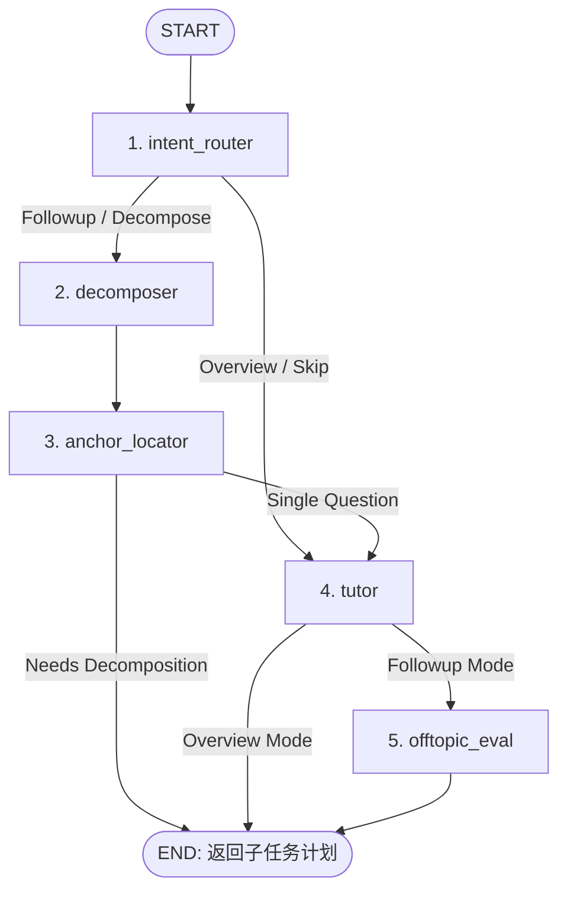

# LatentLearn 🧠🌲

> **专为发散思维者设计的空间化、非线性学习平台。基于 Next.js、FastAPI 和具有状态管理的 LangGraph LLM 工作流构建。**

🌐 **中文版 README | [English README](README_EN.md)**

> [!NOTE]
> **💡 项目想法来源 (Project Origin)**
> 本项目的想法源自于与 AI 进行聚焦学习时的体验：当你已经有一个明确主题，例如阅读一篇论文、理解一个技术概念、研究一个产品时，每一次追问往往都从同一个核心目标自然分叉。在线性聊天中，这些分支会被压平成一条时间线，迫使用户反复滚动、重建上下文，并在脑海中记住每个问题和主主题之间的关系。
> **LatentLearn 作为一个探索性、尝试性的实验小项目**，专门面向有明确主题的学习与研究任务，旨在通过空间化的“焦点树”交互打破线性对话瓶颈，让围绕同一主题产生的疑问能够分支、收纳与回溯，同时不丢失主线。

### 🌐 在线部署
- **前端 Web 应用 (Vercel)**: 🌍 [https://latent-learn.vercel.app](https://latent-learn.vercel.app)
- **后端 Agent API (Hugging Face)**: 🤖 [https://howcloudy-latentlearn-agent.hf.space](https://howcloudy-latentlearn-agent.hf.space) | 🟢 [API 健康状态](https://howcloudy-latentlearn-agent.hf.space/health)

### 📖 产品故事与案例研究
- **Product Case Study (English)**: [From Linear Chat to Non-linear Learning](product-case-study.md)
- **产品案例研究 (中文)**: [从线性聊天到非线性学习](product-case-study.zh-CN.md)

README 负责说明 LatentLearn 是什么、如何运行、架构如何实现；Case Study 是互补的对外产品故事，面向 GitHub 读者、面试官和 portfolio reviewer，重点讲问题定义、产品决策、AI PM 取舍、指标和反思。

---

## 🌟 UX 范式：打破线性对话的陷阱

传统的对话交互界面（如标准的 ChatGPT 或 Claude）强制执行**线性瀑布流模型**：你提问，AI 回答，你再追问，所有内容都挤在一个单一的垂直时间线里。

LatentLearn 并不试图替代所有 AI 聊天场景。它面向的是**主题明确的聚焦知识任务**：用户已经知道自己想理解的对象，而后续追问主要是在同一主题下深化、比较、澄清或定位细节。典型场景包括阅读论文、学习技术概念、分析产品或设计方案，以及围绕一份包含大量局部细节的文档进行探索。

对于**发散思维者、联想型学习者或 ADHD 群体**，这种线性模型构成了认知瓶颈。当探索复杂主题时，联想型大脑自然会产生分支——深入挖掘切向的细节，然后进一步触发子分支。
在线性线索中，这种“兔子洞”式探索会带来两个严重问题：
1. **上下文污染 (Context Pollution)**：模型的对话历史被大量次要细节稀释，从而降低了其对主要主题的理解精度。
2. **迷失主干 (Losing the Trunk)**：想要回到最初的高层话题需要进行大量的向上滚动和重建记忆，带来了极大的认知负荷，导致用户极易中断思路，最终放弃学习。

**LatentLearn** 解决了这一难题。它在空间画布上将学习旅程表示为层次分明的**焦点树 (Focus Tree)**。用户可以自由探索分支，对任何细节繁衍出子树，并在好奇心得到满足后一键收起分支，以完全无杂乱的状态优雅地返回主干路径。

---

## ✨ 核心功能

- **空间文本高亮 (行内分支生成)**：只需高亮选中 AI 回答中的任何词句，点击右键菜单中的 `Ask`、`Explain` 或 `Expand`，系统即可在对应锚定位置原地繁衍出一个全新的卡片。
- **层级焦点树可视化**：侧边抽屉面板渲染交互式的学习节点图。高亮任意卡片会自动聚焦在树上的对应节点；点击树上的节点会平滑滚动到画布的对应位置。
- **认知护栏 (跑题检测器)**：为防止无尽的注意力发散，后台评估器会自动检测当前子分支是否已偏离核心主题太远。在生成回答的同时，会显示明显的重新聚焦提示，允许用户一键返回核心学习路径。
- **分支收纳与整理**：当一个概念完全理解后，点击 `Got it` (已理解)，该子分支会自动收回折叠，同时焦点重回父节点，保持画布清爽。

---

## 📺 产品功能演示

> [!NOTE]
> **演示视频与动图录制中**
> 录制完成后，此处将展示玻璃拟物化过渡效果、响应式焦点树、行内划词触发及跑题检测提示词等核心流程的动图演示。

---

## 🛠️ 技术栈与路线图 (Roadmap)

LatentLearn 采用前后端分离、事件驱动的架构设计，将具有状态管理的 Python LLM 工作流与高响应性的 React 前端相结合。

```
       +-------------------------------------------------------+
       |                  NEXT.JS 前端页面                     |
       |  React 18 / TypeScript 5 / Tailwind CSS / SSE 串流     |
       +----------------------------+--------------------------+
                                    |
                    服务器发送事件 (SSE) 串流
                                    |
       +----------------------------v--------------------------+
       |                  FASTAPI 接口网关                     |
       |         异步接口、CORS 配置、状态格式化                 |
       +----------------------------+--------------------------+
                                    |
                          LangGraph 工作流调用
                                    |
       +----------------------------v--------------------------+
       |                  LANGGRAPH 状态引擎                    |
       |      有状态的 LLM 工作流 / MemorySaver 内存持久化      |
       +-------------------------------------------------------+
```

### 核心技术栈
- **前端**：Next.js 16 (App Router), TypeScript 5, Tailwind CSS, 自定义响应式状态管理, SSE (Server-Sent Events) 串流。
- **后端**：Python 3.10+, FastAPI (异步 Web 网关), Uvicorn。
- **工作流编排**：LangGraph (带条件分支的状态图执行), LangChain。
- **大模型层**：基于 **DeepSeek v4 Flash** (兼容 OpenAI 规范的 API 端点)。

### 发展路线图
- [x] **Phase 1: 双输入管道。** 支持文件导入与自动化主题大纲 (Overview) 生成器。
- [x] **Phase 2: 空间分支核心。** 多层级焦点树状态同步与行内划词触发机制。
- [x] **Phase 3: 有状态 LangGraph 引擎。** 意图路由、上下文内容锚定与自动化跑题检测。
- [ ] **Phase 4: Focus Tree Interactive Showcase (设计展现项目功能的测试/演示网址)。** 独立设计一个专用的测试页面/路由，展示完整的 Focus Tree，包含交互式跑题检测、视觉指引以及分支折叠效果，使用户能够一键感受非线性交互。
- [ ] **Phase 5: Performance & Latency Tuning (解决与优化高时延问题)。** 全链路排查请求延迟（Next.js 代理、FastAPI 服务、LangGraph 单步执行、DeepSeek API 往返时延），定位并解决高时延瓶颈。
- [ ] **Phase 6: PostgreSQL Checkpoint 迁移。** 将内存中的 `MemorySaver` 替换为 `PostgresSaver`，实现跨设备多端历史记录持久化。
- [ ] **Phase 7: 本地 LLM 执行。** 引入本地 Ollama 运行时，支持整个 LangGraph 工作流在 Apple Silicon / 本地 GPU 上完全离线运行。
- [ ] **Phase 8: 语义向量记忆压缩。** 将已理解的分支向量化存入本地向量库 (ChromaDB)，支持在不同主题间语义回溯过去的讨论分支。

---

## 📐 架构设计 (Architectural Design)

### 数据流与请求生命周期

```
[用户划词高亮 / 输入]
         │
         ▼
[前端 SSE 请求]  ──► [FastAPI /stream 接口]
                                │
                                ▼
                     [LangGraph 调用 (AgentState)]
                                │
            ┌───────────────────┴───────────────────┐
            ▼                                       ▼
     [Overview 模式]                        [Follow-up 模式]
     • 运行 intent_router                   • 运行 intent_router
     • 运行 tutor (生成主内容，               • 运行 decomposer (拆解复杂提问)
       提取核心 document_summary)            • 运行 anchor_locator (映射文本锚点)
            │                                └─► 若为纯拆解或 needs_decompose: 结束
            │                                └─► 否则: 运行 tutor (起草本地回答)
            │                               • 运行 offtopic_eval (检测是否跑题)
            │                                       │
            └───────────────────┬───────────────────┘
                                ▼
                       [树状态更新与 SSE 串流]
                                │
                                ▼
                   [React 状态调度器挂载新节点]
```

### LangGraph 工作流定义

LangGraph 工作流被编译为一个结构化的有向无环图 (DAG)，条件化地编排各个大模型与工具节点：



### 节点功能详解
1. **`intent_router` (意图路由器)**：轻量级路由节点，根据入参快速判断执行模式（`overview`, `followup`, `decompose`, `tree_writer`），避免执行冗余 of LLM 步骤。
2. **`decomposer` (提问拆解器)**：当用户输入过于宽泛或包含多个问题时，将任务拆解为结构化的子问题 (`decomposed_questions`)，避免认知过载。
3. **`anchor_locator` (上下文定位)**：检索原文，将提问锚定在最相关的段落，支持**提早退出优化** (Early Exit)：若处于纯拆解模式，此节点执行后工作流将立即终止，节省生成开销。
4. **`tutor` (导师节点)**：核心教学节点，负责整合上下文并输出格式优雅的 Markdown 解答。在 `overview` 模式下，它会**自动提取高提炼度的 `document_summary`** 存入状态中，以便后续节点能以极低的 Token 成本比对跑题状态。
5. **`offtopic_eval` (跑题评估器)**：解析导师输出中的跑题标记，并支持**跑题状态继承**（off-topic inheritance）：在已被判定为跑题的节点下进行的二次提问会直接继承跑题属性，以维持界面交互逻辑的一致性。
6. **`tree_writer` (状态管理器)**：产出有向树更新方案，更新全局状态中的焦点树结构。

此架构专为**有状态大模型工作流 (Stateful LLM Workflow)** 设计，而非全自主的 Multi-Agent 系统。当前的节点各自作为有向图的步骤协同配合，保证了系统的响应可控性，同时也为未来引入独立审校 (Critic)、知识检索 (Retrieval) 或学习教练 (Coach) 等多智能体拓展打下了良好基础。

---

## 🔬 开发者工具：LangGraph & LangSmith 使用指南

项目深度集成了企业级的调试与观测工具，支持直观监控 LLM 工作流的状态变化。

### 1. LangGraph CLI 与本地 Studio GUI

LangGraph CLI 提供了一个功能强大的可视化界面，支持在本地调试图节点与模拟执行。

#### 安装方法
确保拥有 Python 3.10+ 环境，并安装 CLI：
```bash
pip install "langgraph-cli[io]"
```

#### 启动开发服务器
在项目根目录下执行：
```bash
langgraph dev
```
此命令将启动本地服务器 [http://localhost:8123](http://localhost:8123)，并自动打开 Web 端的可视化 **LangGraph Studio GUI**。

#### 在 LangGraph Studio 中你可以：
- **可视化 DAG 执行**：实时查看执行路径，高亮指示正在运行的节点。
- **检查状态历史**：查看每个节点运行前后的 `AgentState` 数据。
- **节点单步测试**：手动触发单个节点（如跑题检测、锚点定位）并在线修改入参。
- **线程回放**：查看以往对话线程，支持从指定节点重新运行或替换输入。

---

### 2. 生产环境链路追踪 (LangSmith)

**LangSmith** 提供生产级的全链路监控，记录每一次 LLM 调用、Token 消耗、响应时延及状态修改。

#### 配置步骤
1. 注册并登录 [LangSmith](https://smith.langchain.com)。
2. 进入 **Settings** -> **API Keys** 创建一个新的 API Key。
3. 打开 `agent/.env.agent`，填入以下变量：

```env
LANGCHAIN_TRACING_V2=true
LANGSMITH_API_KEY=您的_langsmith_api_key
LANGSMITH_PROJECT=latentlearn-agent
LANGCHAIN_ENDPOINT=https://api.smith.langchain.com
```

4. 重启后端服务，所有调用将自动同步至云端控制台。

#### 核心监控能力：
- **交互式调用栈**：点击查看每一步 Prompt 输入、模型原生输出、各节点时延。
- **Token 与费用统计**：精确追踪单次运行的输入/输出 Token 数量，便于进行 Prompt 裁剪与成本控制。
- **数据回馈与测试集构建**：可以在平台中将某次运行标记为“Good”或“Bad”，快速积累微调或评测数据集。

---

## ⚡ 快速开始：一键启动脚本

我们提供了一个统一的启动脚本，会自动检查端口、安装依赖、创建虚拟环境并并发启动前后端。

一键运行前端与后端：
```bash
npm start
```

### 启动流程背后的动作：
1. **清理端口占用**：自动检查端口 `3000` (Next.js) 与 `8100` (FastAPI)，如果被占用则安全终止。
2. **复制环境变量**：如果不存在 `.env.local`，自动从模板文件复制。
3. **安装前端依赖**：运行 `npm install`。
4. **复制后端环境变量**：若无 `agent/.env.agent`，自动从模板复制。
5. **构建 Python 虚拟环境**：自动创建 `agent/.venv` 并根据 `requirements.txt` 安装依赖包。
6. **启动开发服务**：并发启动 Python FastAPI 服务 ([http://127.0.0.1:8100](http://127.0.0.1:8100)) 与 Next.js 开发服务 ([http://localhost:3000](http://localhost:3000))。
7. **优雅退出**：捕获退出信号 (`Ctrl+C`)，干净地终止后台 Python 线程再关闭进程。

---

## ⚙️ 环境变量配置参考

项目中的前端和后端分别读取各自的环境变量配置文件。

### Next.js 前端配置 (`.env.local`)
```env
# 官方 DeepSeek 备用接口。配置 AGENT_API_URL 时优先走后端 LangGraph 代理
LLM_PROVIDER=deepseek
LLM_API_KEY=您的_api_key
LLM_BASE_URL=https://api.deepseek.com
LLM_CHAT_COMPLETIONS_PATH=/chat/completions
LLM_MODEL=deepseek-v4-flash
LLM_REQUIRE_FREE_MODEL=false

LLM_TEMPERATURE=0.4
LLM_MAX_TOKENS=2200

AGENT_API_URL=http://127.0.0.1:8100
```

### LangGraph 后端配置 (`agent/.env.agent`)
```env
# LangGraph 全局调用的 DeepSeek API 秘钥
AGENT_LLM_API_KEY=您的_api_key
AGENT_LLM_BASE_URL=https://api.deepseek.com
AGENT_LLM_MODEL=deepseek-v4-flash

# 生成参数限制
AGENT_LLM_TEMPERATURE=0.4
AGENT_LLM_MAX_TOKENS=2200

# 后端 FastAPI 绑定地址
AGENT_HOST=127.0.0.1
AGENT_PORT=8100
AGENT_CORS_ORIGINS=http://localhost:3000

# 链路观测 (可选)
LANGCHAIN_TRACING_V2=true
LANGSMITH_API_KEY=您的_langsmith_api_key
LANGSMITH_PROJECT=latentlearn-agent
LANGCHAIN_ENDPOINT=https://api.smith.langchain.com
```

---

## 🛠️ 手动分步运行命令

若希望在不同的终端窗口中独立运行各个模块：

### 独立启动前端：
```bash
npm install
npm run dev
```
启动后访问 [http://localhost:3000](http://localhost:3000)。

### 独立启动后端：
```bash
cd agent
python3 -m venv .venv
source .venv/bin/activate
pip install -r requirements.txt
PYTHONPATH=.. uvicorn main:app --host 127.0.0.1 --port 8100 --reload
```
启动后访问 [http://127.0.0.1:8100](http://127.0.0.1:8100)。

---

## 👥 贡献与交流
本项目由 ❤️ 驱动，专为不习惯线性思考的活跃思维而生。非常欢迎任何 Pull Request、设计反馈或功能建议！

---

## 📜 引用与致谢声明

如果 LatentLearn 的设计启发了您的项目，烦请在您的项目中附带提及 **"Inspired by LatentLearn"** 并链接回此仓库。

虽然这不是开源协议的硬性约束，但适当的致谢不仅能温暖开发者，也能帮助更多发散思维的学习者了解和探索非线性交互的可能性。 🌟
