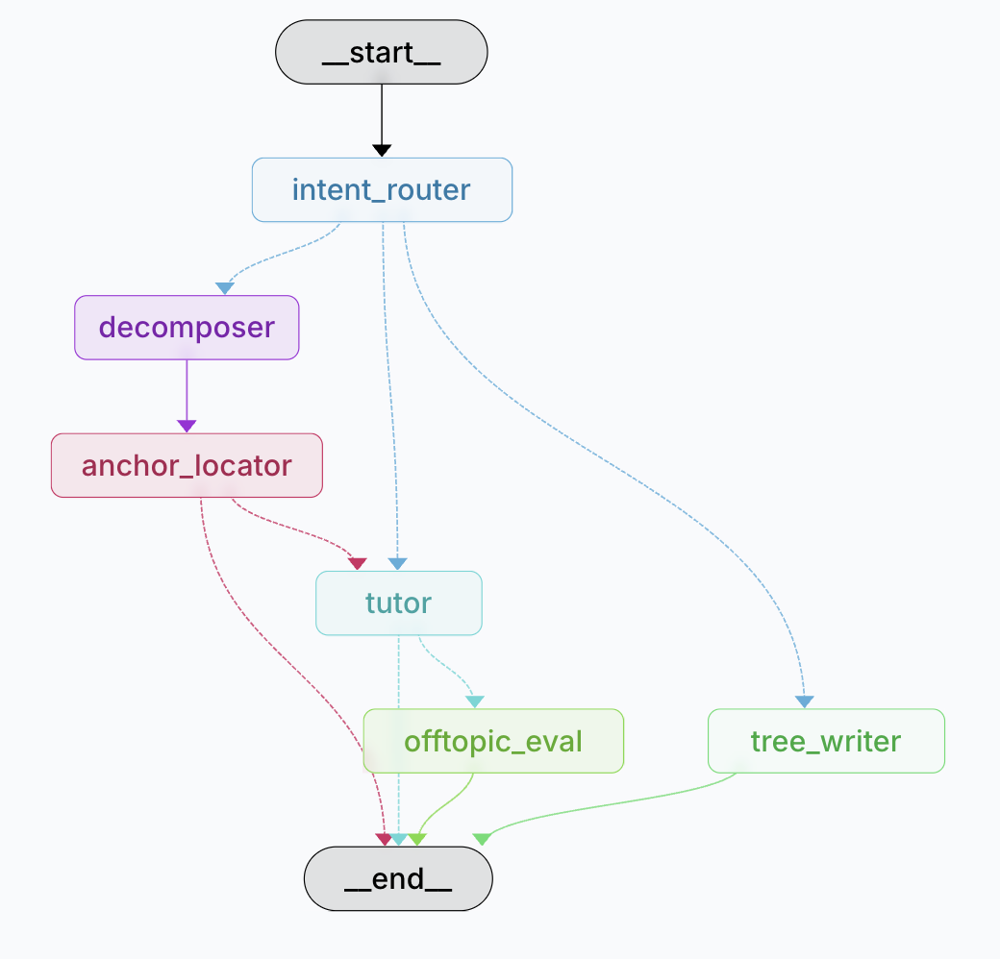

# LatentLearn 🧠🌲

### 专为发散思维与非线性学习设计的空间智能平台

  <strong>主讲人：</strong> 项目团队 
  <strong>技术栈：</strong> Next.js / FastAPI / Stateful LangGraph / Google AI Studio / Gemma 4 
  <strong>定位：</strong> 2026 创新 AI 智能体应用研究与演示

<!-- _footer: LatentLearn Project Roadshow Presentation -->

---

## 01. 传统 AI 交互的“线性陷阱”

### 传统 AI 对话（如 ChatGPT 瀑布流）对于发散思维者存在天然的设计瓶颈：

  

    <h3>🍂 1. 上下文污染 (Context Pollution)</h3>
    

      当探讨某个主线概念时，用户被某个细节吸引并深入追问。分支讨论的内容会被直接混入主会话历史中。
        
      后果： 后续的对话中模型极易受到“分支杂音”干扰，导致对核心主线的理解大幅退化。
    

  

  

    <h3>🌲 2. 迷失主干 (Losing the Trunk)</h3>
    

      在漫长的一维瀑布流对话中，当用户满足了局部好奇心，想回到最初的高层概念时，需要经历极高的“向上滚动”心智负载。
        
      后果： 极易打断学习连贯性，导致用户精力耗散并选择放弃会话。
    

  

---

## 02. 空间非线性学习：LatentLearn 范式革命

### 我们打破一维对话流，将学习过程重塑为空间画布上的“Focus Tree (聚焦树)”

  

    <h3 style="margin-top: 0;">💡 核心哲学</h3>
    

      发散思维（ADHD / 关联型学习者）的学习不是一条直线，而是一棵繁茂的树。  
      我们允许用户在知识的侧枝上<strong>无限生长新芽</strong>，又能在好奇心满足后，通过<strong>一键折叠</strong>，轻盈地退回思维主干。
    

  

  

    

      <h4 style="margin: 0; color: #00f0ff;">📍 划词分支 (Inline Branching)</h4>
      
直接在 AI 文本中划词，即可就地生成新会话卡片，不污染原上下文。

    

    

      <h4 style="margin: 0; color: #ff2a5f;">🛡️ 离题护栏 (Off-Topic Guardrails)</h4>
      
后台感知算法，当追问偏离主线过远时启动温馨提醒，避免无限下钻迷失。

    

    

      <h4 style="margin: 0; color: #ffd269;">🌲 树形看板 (Focus Tree Drawer)</h4>
      
侧边直观展示学习足迹节点树，卡片与节点双向联动，极速定位。

    

  

---

## 03. 核心功能与交互美学

  

    <h3>✨ 1. 极致磨砂玻璃态 UI</h3>
    

      响应式毛玻璃效果（Glassmorphic UI），自适应暗色、亮色主题。微动效卡片弹窗、流畅的滚动缩放，为非线性探索提供丝滑的视觉过渡。
    

    <h3>📍 2. 划词微菜单交互</h3>
    

      用户在卡片内拖动选中任意关键词，即刻触发气泡式微菜单：
      <code style="color: #00f0ff;">Ask</code> / <code style="color: #ff2a5f;">Explain</code> / <code style="color: #ffd269;">Expand</code>。
      一键将好奇心转化为新分支。
    

  

  

    <h3>🛡️ 3. 离题继承与一键回归</h3>
    

      离题检测器自动标识超纲节点。一旦卡片被标为“偏离核心”，其下方子分支自动继承偏离状态，卡片顶部出现 “一键回归” 按钮，带你顺畅退回最近的主线节点。
    

    <h3>✅ 4. 节点完结与“理解折叠”</h3>
    

      当发散点学习完毕后，点击“已掌握（Got it）”，分支卡片淡出折叠，主干节点重获视觉高亮。极简画布，随心掌控。
    

  

---

## 04. 整体技术架构：分层解耦与流式通信

  

  

    <h4 style="margin: 0; color: #00f0ff; font-size: 18px;">🌐 Next.js 前端 (React 18)</h4>
    

      采用 <strong>App Router</strong>，全站 TypeScript 5 严格类型约束。 
      • <strong>Server-Sent Events (SSE)</strong> 流式解析引擎。 
      • 局部状态 Reducer 精准控制 Focus Tree 节点挂载、折叠与画布平移。
    

  

  

    <h4 style="margin: 0; color: #ffd269; font-size: 18px;">⚡ FastAPI 异步网关 (API)</h4>
    

      使用 Python 异步架构，吞吐量极高。 
      • <strong>安全沙箱：</strong> 执行深度输入清洗 (Sanitize)，防御提示词注入。 
      • <strong>实时路由：</strong> 建立长连接 SSE 管道，实时向下游推送 Token。
    

  

  

    <h4 style="margin: 0; color: #ff2a5f; font-size: 18px;">🌲 LangGraph 状态机后端</h4>
    

      基于有向无环图 (DAG) 的多智能体系统。 
      • <strong>线程检查点 (Checkpointer)：</strong> 自动对每一次探索生成记忆存档。 
      • <strong>外置算力：</strong> 深度对接 Google AI Studio 并调度 Gemma 4 模型。
    

  

---

## 05. 核心智能大脑：LangGraph Agent 编排 DAG

### 基于状态的多智能体协作，精准执行意图识别、智能拆解、内容扩充与合规判定

  

    
  

  

    

      1. `intent_router` 意图路由
      
智能分析用户输入，非阻塞分流到核心通路。

    

    

      2. `decomposer` 多路拆解器
      
将庞杂或模糊问题，解构为有序子问题数组。

    

    

      3. `tutor` & `anchor_locator` 知识导师与定位器
      
锁定上下文片段，流式生成结构化 Markdown 回答。

    

    

      4. `offtopic_eval` 离题偏差评估
      
比对全局摘要，智能判定问答是否偏离核心主干。

    

  

---

## 06. 核心算法突破与技术攻关

  

    <h3>📡 1. 混合流过滤技术 (SSE Chunk Filter)</h3>
    

    

      <strong>痛点：</strong> LangGraph 节点（如分解、树写入）在后台流式输出 JSON 时，前端会误将 JSON 字符作为正常导师回答吐字播放，用户体验崩塌。
        
      <strong>攻关：</strong> 实现
      Event-Stream 节点白名单过滤机制。
      通过底层 `astream_events` 实时拦截，仅当事件流来自 <code style="color:#00f0ff;">tutor</code> 节点，且满足 `on_chat_model_stream` 类型时才放行至前端。
    

  

  

    <h3>🌲 2. 离题继承与提前退出优化</h3>
    

    

      <strong>离题继承：</strong> 子卡片的追问天然依赖父卡片的上下文。若父卡片已被标定为偏离主干，后续子分支直接继承 Off-topic 标记，节省大模型计算开销。
        
      <strong>早期退出 (Early Exit)：</strong> 在复合拆解模式下，当 `anchor_locator` 完成对文章片段定位且识别到子问题列表后，图状态机在 tutor 节点前执行 
      Early-Exit 熔断机制，不执行高昂的 LLM 回答节点，立即下发问题拆解计划（QuestionPlan）。
    

  

---

## 07. 开发者体验：可视化调试与生产级观测

  

    <h3>🖼️ 1. LangGraph Studio 可视化双向调试</h3>
    

      完全集成 <strong>LangGraph CLI 调试套件</strong>，通过 <code style="color:#00f0ff;">langgraph dev</code> 开启本地可视化工作台：
    

    <ul style="font-size: 16px; color: #94a3b8;">
      <li><strong>动态轨迹：</strong> 实时追踪状态机执行至哪个节点（如 Decomposer、Tutor）。</li>
      <li><strong>状态时空穿梭：</strong> 随意更改、回滚 `AgentState` 变量，直接在 GUI 界面模拟报错和极端的并发边界测试。</li>
    </ul>
  

  

    <h3>📈 2. LangSmith 生产级遥测 (Telemetry)</h3>
    

      后端完全启用 <strong>LangSmith 深度链路分析系统</strong>：
    

    <ul style="font-size: 16px; color: #94a3b8;">
      <li><strong>单次调用链路穿透：</strong> 精准剖析每个 LLM 调用的 Prompt、消耗的 Token 量及延迟（Latency）。</li>
      <li><strong>反馈回路与数据集积累：</strong> 通过在 LangSmith 面板标记“优/劣”，一键导出测试集，为后期 LLM 调优和 Prompt 迭代打下闭环数据基石。</li>
    </ul>
  

---

## 08. 智能学习核心链路与技术路线

  <table style="width: 100%; border-collapse: collapse; font-size: 15px; text-align: left;">
    <thead>
      <tr style="background: rgba(0, 240, 255, 0.1); color: #00f0ff;">
        <th style="width: 22%;">核心支柱 (Pillar)</th>
        <th style="width: 25%;">后端 Agent 逻辑</th>
        <th style="width: 28%;">智能运行机制</th>
        <th style="width: 25%;">认知与交互价值</th>
      </tr>
    </thead>
    <tbody>
      <tr>
        <td>1. 复合问题智能拆解 (Query Decomposition)</td>
        <td>• <code>decomposer</code> 节点 • 结构化 QuestionPlan 格式</td>
        <td>• Early-Exit 早期熔断优化 • 用户学习意图轻量分类器</td>
        <td>避免庞大知识一次性平铺； 让多重疑问按逻辑顺序逐步攻克</td>
      </tr>
      <tr>
        <td>2. 树状会话关联挂载 (Branch Mounting)</td>
        <td>• <code>tree_writer</code> 节点 • Context Anchor 原文定位器</td>
        <td>• 前端 Reducer 同步多层树状态 • 高度自适应划词关联锚定</td>
        <td>彻底告别一维滚动杂乱； 允许无限探索细分好奇心侧枝</td>
      </tr>
      <tr>
        <td>3. 多维语义偏离检测 (Off-Topic Guardrails)</td>
        <td>• <code>offtopic_eval</code> 节点 • 全局 document_summary check</td>
        <td>• 离题状态向下自动继承机制 • 触发器与“一键回归”重定位</td>
        <td>实时侦测发散思路的偏离度； 提供温和导流护栏，阻断精力耗散</td>
      </tr>
    </tbody>
  </table>

---

# 让思维自由生长，在关联中发现深意

<blockquote>
  "The mind is not a vessel to be filled, but a fire to be kindled." —— Plutarch
   
  （心灵不是一个被填充的容器，而是一团被点燃的火焰。）
</blockquote>

  

    <h3 style="margin: 0; color: #00f0ff;">LatentLearn 发散学习空间</h3>
    
感谢您的聆听！期待您的宝贵意见。

  

  

    Q & A 环节
  

